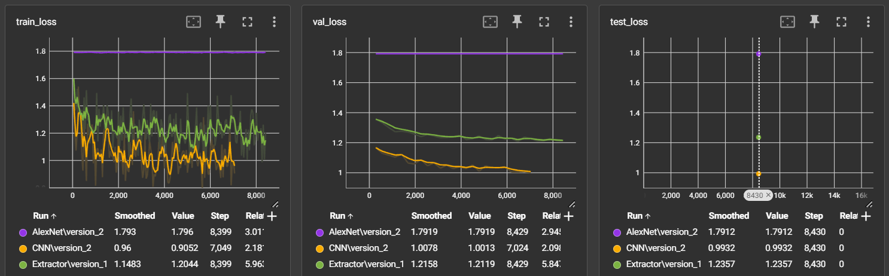

# Classification task
Create classificators and compare:
- classical features + knn/svm/linear classificator
- CNN+MLP with your own architecture
- Finetuned CNN (Feature Extractor)

Code is located in `src/classification_task` and used models are located in `src/classification_models`

## Comparison between NN models

|   Test metric     | KNN  | CNN   | AlexNet | Finetuned CNN |
|   -----------     |------|-------|---------|---------------|
|    test_loss      | -    | 0.993 | 1.791   | 1.236         |
|  test_accuracy    | 0.37 | 0.614 | 0.184   | 0.54          |
| test_precision    | 0.46 | 0.238 | 0.179   | 0.199         |
|   test_recall     | 0.36 | 0.156 | 0.187   | 0.113         |

### Training loss

