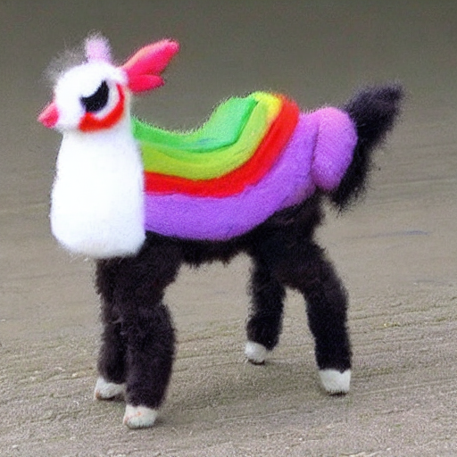

# Generative Models — LoRA Fine-Tuning of Stable Diffusion

## Task

Fine-tune a pretrained text-to-image diffusion model to generate Pokemon-style images from text prompts.

## Approach

**Base model:** Stable Diffusion v1.5 (`stable-diffusion-v1-5/stable-diffusion-v1-5`)

**Method:** LoRA (Low-Rank Adaptation) — only small adapter matrices injected into the UNet's cross-attention layers (`to_k`, `to_q`, `to_v`, `to_out.0`) are trained. The rest of the model (VAE, text encoder, UNet backbone) stays frozen.

**Dataset:** `reach-vb/pokemon-blip-captions` — Pokemon images paired with BLIP-generated text captions from HuggingFace.

### Training Configuration

| Parameter | Value |
|---|---|
| Resolution | 512 x 512 |
| Batch size | 1 |
| Gradient accumulation steps | 4 (effective batch size = 4) |
| Epochs | 50 |
| Learning rate | 1e-6 |
| LoRA rank | 4 |
| Optimizer | AdamW |
| Loss | MSE (noise prediction) |
| Precision | float32 |

### Pipeline

1. **Encode** — images are projected into latent space by the frozen VAE encoder; captions are tokenized and encoded by the frozen CLIP text encoder.
2. **Forward diffusion** — Gaussian noise is added to the latents at a random timestep via the DDPM scheduler.
3. **Denoise** — the UNet (with LoRA adapters) predicts the added noise, conditioned on the text embeddings.
4. **Loss** — MSE between predicted and actual noise drives the LoRA weight updates.
5. **Save** — only the LoRA adapter weights are saved (~3 MB), not the full model.

## Inference

The pretrained SD v1.5 pipeline is loaded and the LoRA weights are applied on top:

```python
pipe = DiffusionPipeline.from_pretrained("stable-diffusion-v1-5/stable-diffusion-v1-5")
pipe.load_lora_weights("../pokemon-lora")
image = pipe("a cute pokemon llama").images[0]
```

## Result

**Prompt:** `"a cute pokemon llama"`



The model generates a stylized llama with rainbow-colored body markings and expressive eyes, consistent with the Pokemon art style from the training data.

## Key Files

| File | Description |
|---|---|
| `src/finetune.py` | LoRA fine-tuning script |
| `src/inference.py` | Inference script for generating images |
| `pokemon-lora/pytorch_lora_weights.safetensors` | Trained LoRA adapter weights (~3 MB) |
| `pokemon.png` | Generated sample image |
