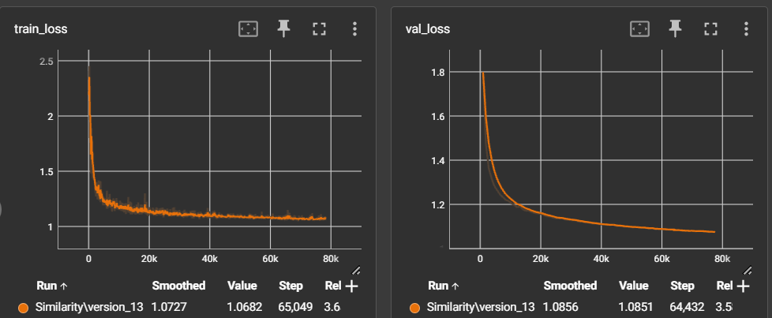

# Metric Learning or Similarity Search

Task: Build a system which can find a visually similar product in the catalog by a photo-query

Code: `src/similarity_search.py`

Metric on test data -- Top1 = 69%

Graphics of training:

