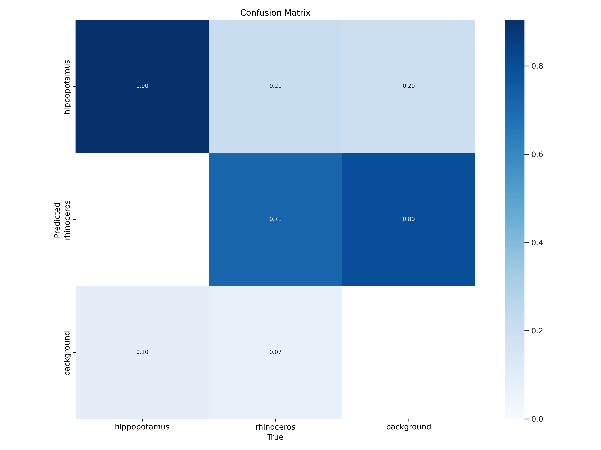
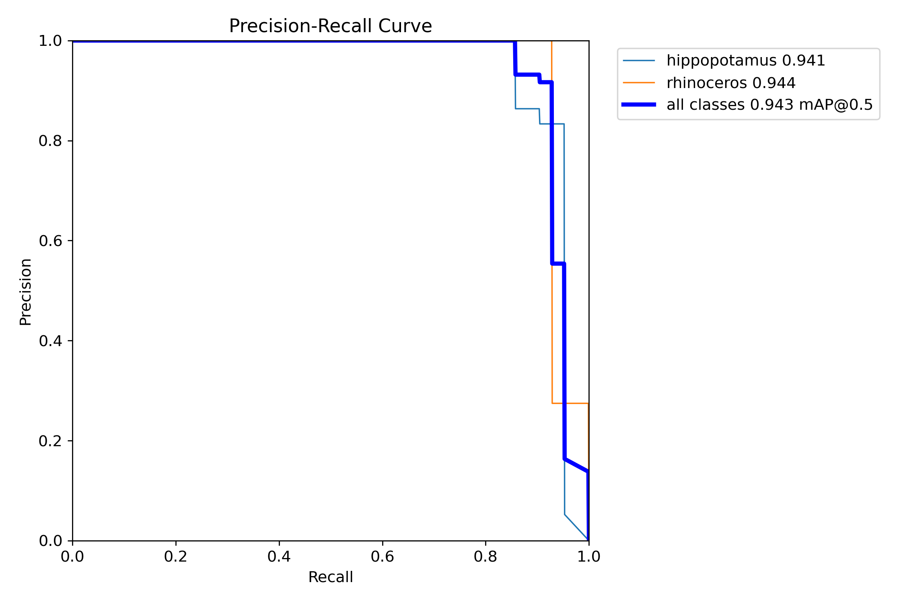
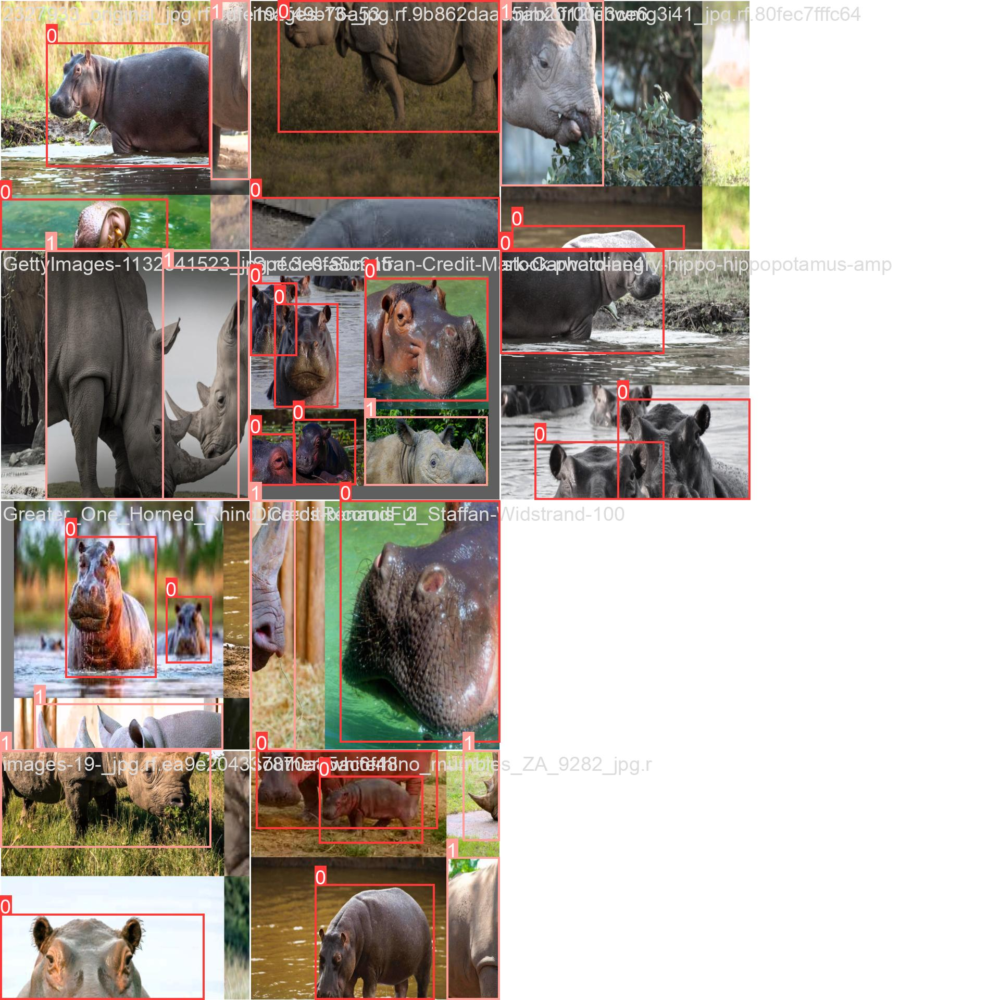
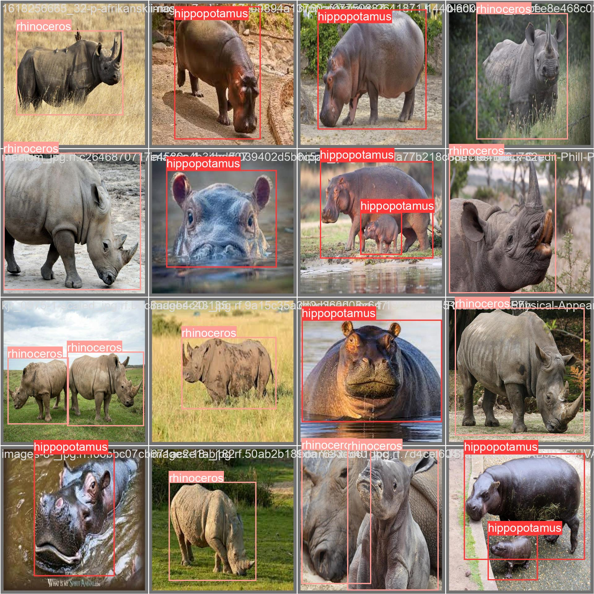

# Object Detection

- Take 2 or more objects (which are not presented in COCO/OpenImages)
- Take a photo of them
- Label them using CVAT or VGG VIA
- Train an object detection model

## Dataset

Hyppopotamus and Rhinoceros were chosen as objects.

I prepared the Dataset: found images, labeled them with Roboflow, split for train, validation and test. 

## Model YOLO parameters:
[opt.yaml](opt.yaml)

## Metrics Yolo

### Confusion matrix:

### Precision-Recall:

## Examples of batches:

### Train:

### Validation:
