# Segmentation

Task: 
- Train a model which can count number of rods in photo
- Model: UNET + blob detection for counting
- Metric: MAPE + Visualization of mask

Code: `src/segmentation_task.py` and used model with pytorch lightner classes are in `src/segmentation/`

Loss for training - **Dice loss**

## Training model:
### Without augmentation
Size of the image (224, 224), precision = float32

Training loss:

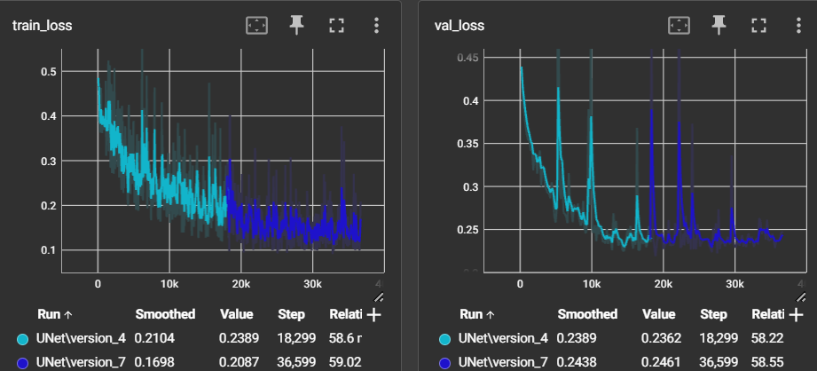

### With augmentation
For this experiment augmentation was added: A.HorizontalFlip(p=0.5), A.VerticalFlip(p=0.5), A.GaussianBlur(3).

Moreover, size of the image was changed to (512, 512), but precision was reduced to "16-mixed", that is equal to float16.

Training loss:

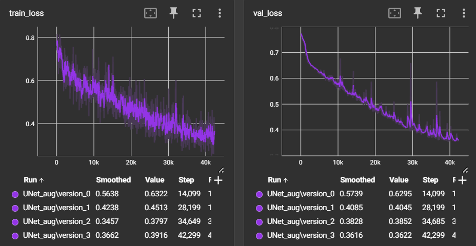

## Results

Here are model outputs - masks - from the test dataset.

| model               | images                                                                                                                                                                                                                                                                                           |
|---------------------|--------------------------------------------------------------------------------------------------------------------------------------------------------------------------------------------------------------------------------------------------------------------------------------------------|
| original image      | 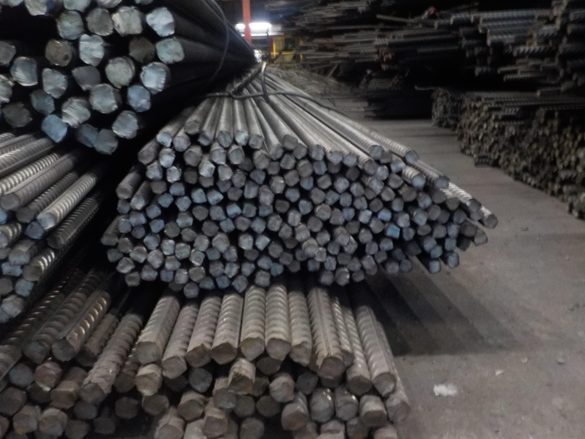,  ,  ,                                                              |
| oririgal mask       | 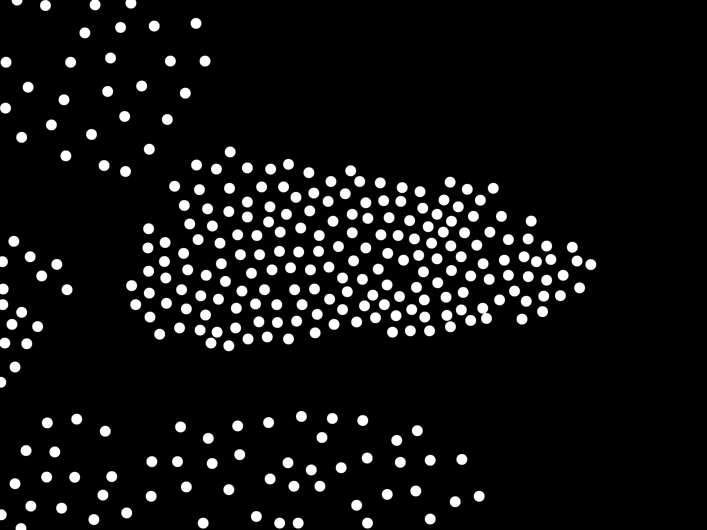,  ,  ,                      |
| Unet no augmentation | 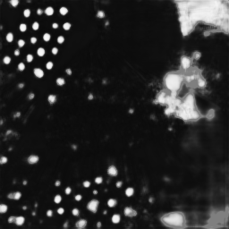, 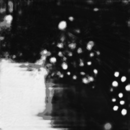, 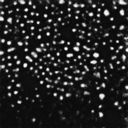, 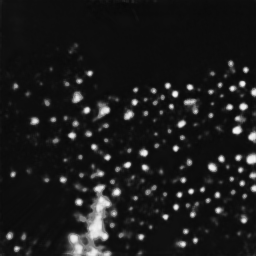 |
| Unet w/ augmentation | 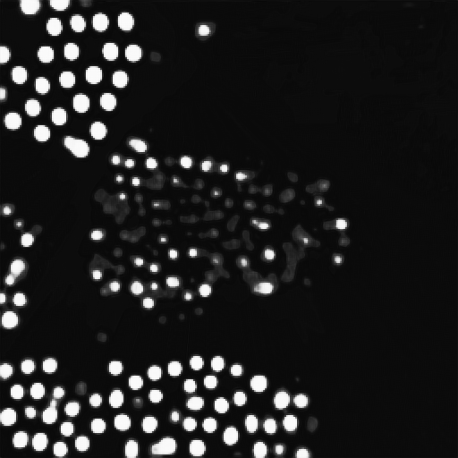, 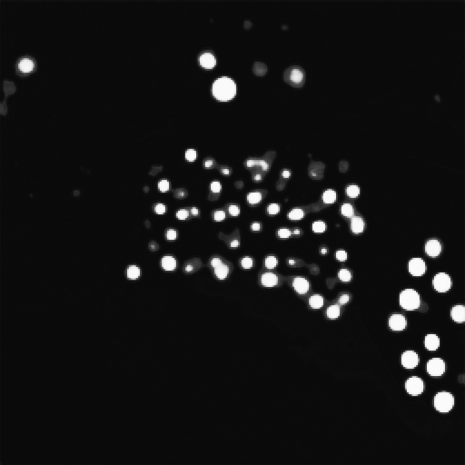, 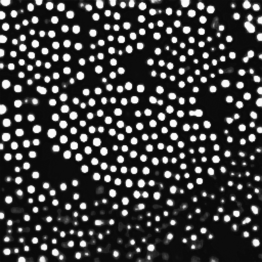, 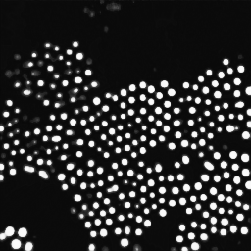           |

### Blob detection examples:

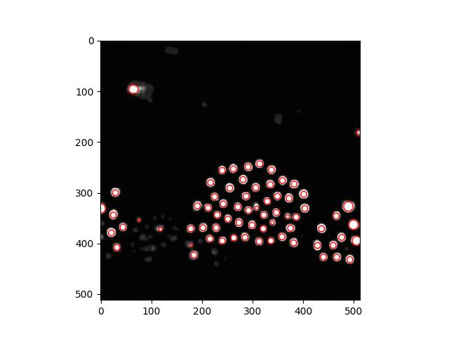
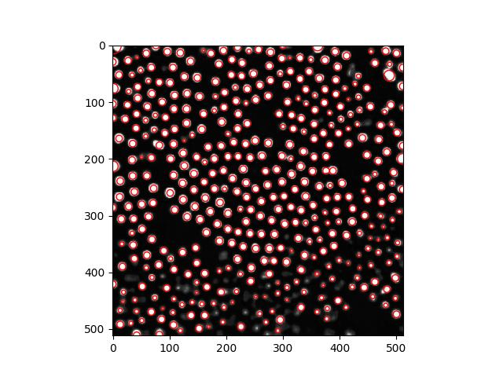