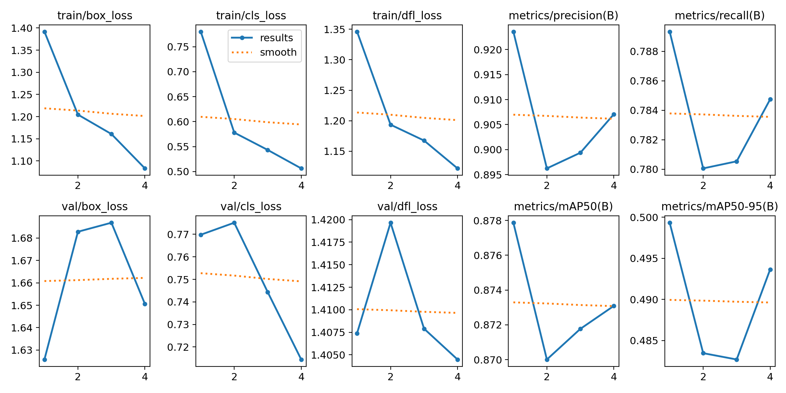
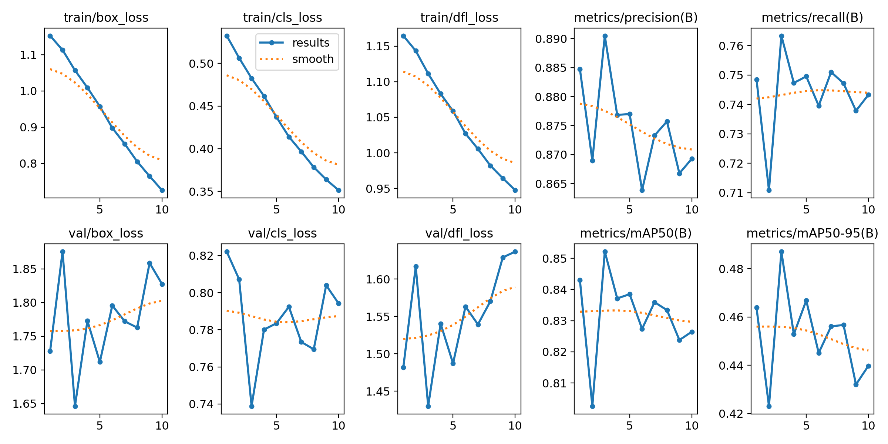

# tracking

4 epochs train for YOLO:
- 0.4996137948799465
- 0.8779423064938856
- 0.5072169319776592
- [    0.49961]
- array([    0.85122])

14 epochs train for Yolo:
- map50-95 = 0.48745224796724174
- map50 = 0.8521788058746118
- map75 = 0.5085273236783254
- maps = [    0.48745]
- f1: array([    0.82201])

