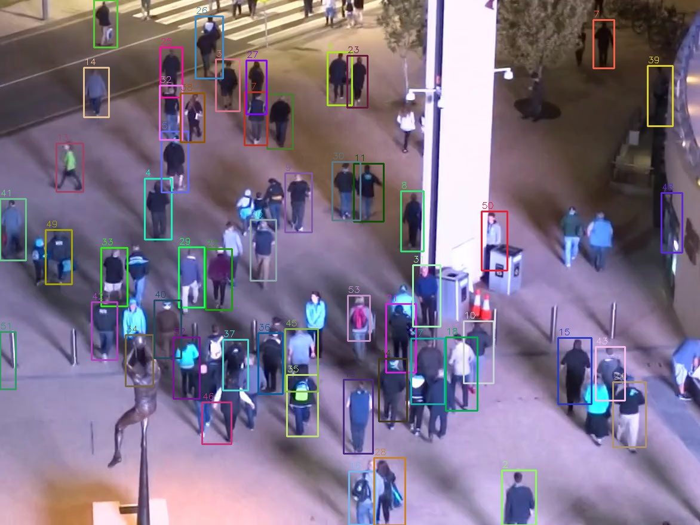
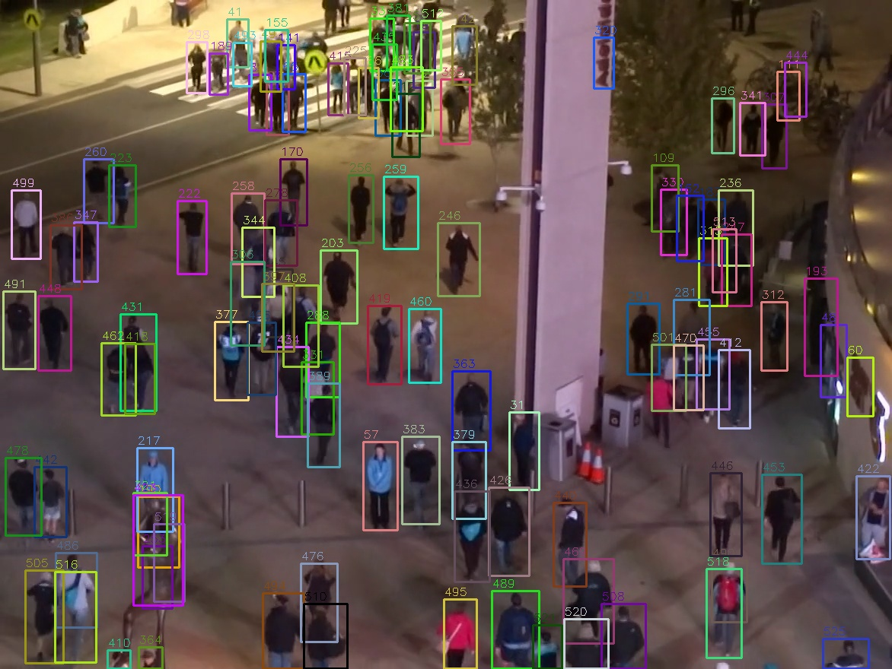
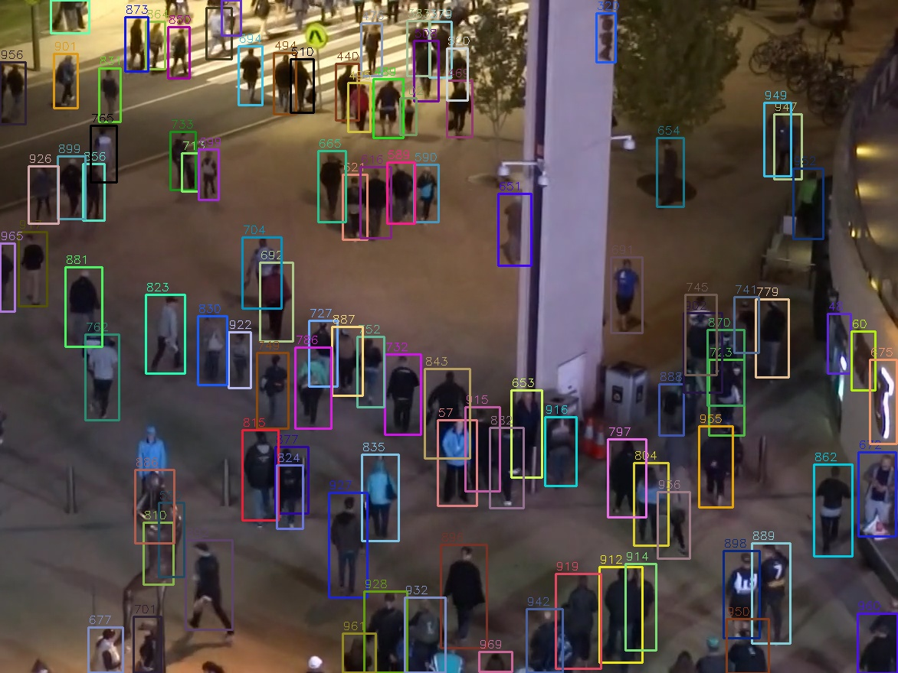
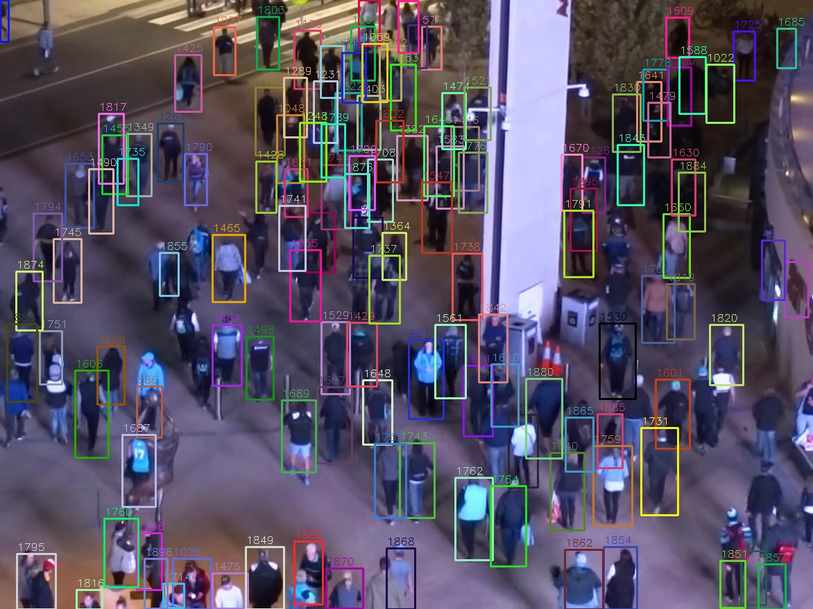

# Tracking

Task: Person tracking on the MOT20 dataset using YOLO (detector + built-in BoTSort tracker) + FiftyOne (dataset management & evaluation).

Code: `src/tracking_51.py`, notebook: `tracking.ipynb`

## Dataset

MOT20 — crowded pedestrian scenes.

| Split | Sequences | Purpose |
|---|---|---|
| train | MOT20-01, MOT20-02 | YOLO training |
| val | MOT20-03 | Hyperparameter tuning |
| labeled_test | MOT20-05 | Final evaluation (held out) |
| test (no GT) | MOT20-04, 06, 07, 08 | Inference only |

## Model

**Detector:** YOLO11s, trained 50 epochs on MOT20-01 + MOT20-02.

| Parameter | Value |
|---|---|
| Model | yolo11s.pt |
| Epochs | 50 |
| Batch size | auto |
| Image size | 640 |
| Learning rate | 0.01 |
| Tracker conf | 0.4 |
| Tracker IoU | 0.6 |

## Training

### Loss & metrics curves (50 epochs)

### Precision-Recall curve

### Confusion matrix

## Hyperparameter tuning (detector)

Tuned on validation set (MOT20-03) with 14-epoch model:

| Parameters | F1 Score | mAP@0.5 |
|---|---|---|
| conf=0.4, iou=0.4 | 0.841 | 0.870 |
| conf=0.4, iou=0.5 | 0.850 | 0.879 |
| **conf=0.4, iou=0.6** | **0.852** | **0.882** |
| conf=0.5, iou=0.4 | 0.837 | 0.861 |
| conf=0.5, iou=0.5 | 0.846 | 0.869 |
| conf=0.5, iou=0.6 | 0.849 | 0.871 |

Best parameters: `conf=0.4, iou=0.6`

## Tracking results (50-epoch model)

### Validation — MOT20-03

| TP | FP | FN | Precision | Recall | F1 |
|---|---|---|---|---|---|
| 224,499 | 49,118 | 89,159 | 0.821 | 0.716 | 0.765 |

### Test — MOT20-05

| TP | FP | FN | Precision | Recall | F1 |
|---|---|---|---|---|---|
| 362,256 | 133,119 | 284,088 | 0.731 | 0.561 | 0.635 |

## Tracking examples

### Validation — MOT20-03 (sample frames)

 

 

### Test — MOT20-05 (full annotated video)

<video src="results_data/movi_MOT20-05.mp4" width="600" controls></video>
